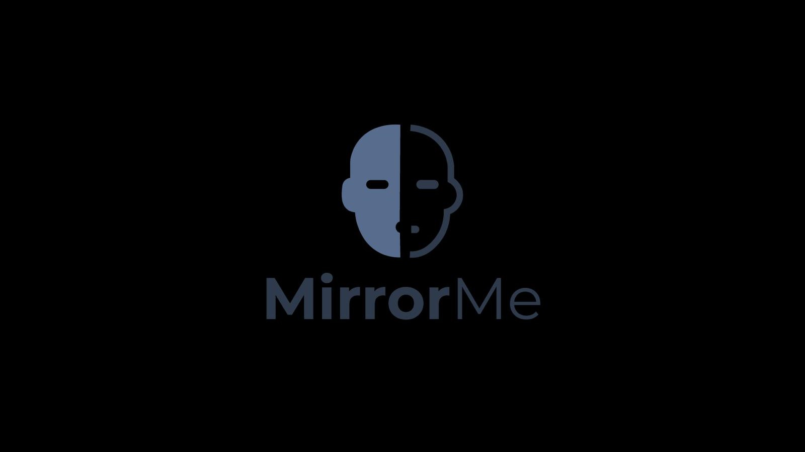

<div align="center">
  
  
  # MirrorMe WorkWell Agent
  
  ### Your Digital Twin for Workplace Wellbeing
  ### توأمك الرقمي للصحة النفسية في العمل
  
  [](https://www.ibm.com/cloud/watsonx-orchestrate)
  [](https://nextjs.org/)
  [](https://supabase.com/)
  [](https://www.typescriptlang.org/)
  
</div>

---

## 🌟 Overview

MirrorMe WorkWell is an intelligent, agentic mental wellbeing orchestrator built on **IBM watsonx Orchestrate**. It is designed to monitor employee wellness, detect early signs of burnout, and trigger smart, automated support actions for both individuals and teams.

By leveraging AI and digital twin technology, MirrorMe WorkWell provides a proactive approach to HR and employee health, ensuring a balanced and productive work environment.

## 🚀 Features

- **Daily Wellbeing Check-ins**: Simple and intuitive interface for employees to log their mood and daily status.
- **AI-Powered Sentiment Analysis**: Automatically analyzes check-in data to detect underlying emotional trends and potential risks.
- **Risk Assessment & Recommendations**: Provides real-time feedback and actionable recommendations based on calculated risk levels.
- **HR Analytics Dashboard**: Comprehensive view for HR managers to monitor team health, identify at-risk departments, and visualize trends over time.
- **Digital Twin Integration**: (Experimental) Creates a digital representation of employee wellbeing to simulate and predict future states.
- **IBM watsonx Orchestrate Integration**: Seamlessly connects with enterprise workflows to automate support actions.

## 🛠️ Tech Stack

- **Frontend**: [Next.js 16](https://nextjs.org/) (App Router), [React 19](https://react.dev/), [Tailwind CSS v4](https://tailwindcss.com/)
- **Backend Services**: [Supabase](https://supabase.com/) (PostgreSQL & Auth) accessed via Client Services
- **AI Integration**: Google Gemini (via Client SDK) & IBM watsonx Orchestrate (Integration Ready)
- **Language**: TypeScript

## 📂 Project Structure

```
MirrorMe-WorkWell-Agent/
├── agent-skills/       # OpenAPI specifications for IBM Orchestrate skills
├── web-app/            # Main Next.js application
│   ├── app/            # App Router pages
│   ├── components/     # Reusable React components
│   ├── lib/            # Shared utilities and service clients
│   └── public/         # Static assets
└── README.md           # Project documentation
```

## 🏁 Getting Started

### Prerequisites

- Node.js (v18 or higher)
- npm or yarn
- A Supabase project
- IBM Cloud account (for watsonx Orchestrate features)

### Installation

1.  **Clone the repository:**
    ```bash
    git clone https://github.com/your-username/MirrorMe-WorkWell-Agent.git
    cd MirrorMe-WorkWell-Agent
    ```

2.  **Install dependencies:**
    Navigate to the `web-app` directory and install the required packages.
    ```bash
    cd web-app
    npm install
    ```

3.  **Environment Configuration:**
    Create a `.env.local` file in the `web-app` directory with the following variables:

    ```env
    NEXT_PUBLIC_SUPABASE_URL=your_supabase_url
    SUPABASE_SERVICE_ROLE_KEY=your_supabase_service_role_key
    IBM_ORCHESTRATE_API_KEY=your_ibm_api_key
    IBM_ORCHESTRATE_BASE_URL=your_ibm_base_url
    ```

4.  **Run the Development Server:**
    ```bash
    npm run dev
    ```

    Open [http://localhost:3000](http://localhost:3000) with your browser to see the result.

## 🤝 Contributing

Contributions are welcome! Please feel free to submit a Pull Request.

1.  Fork the project
2.  Create your feature branch (`git checkout -b feature/AmazingFeature`)
3.  Commit your changes (`git commit -m 'Add some AmazingFeature'`)
4.  Push to the branch (`git push origin feature/AmazingFeature`)
5.  Open a Pull Request

## 📄 License

This project is licensed under the MIT License - see the [LICENSE](LICENSE) file for details.
